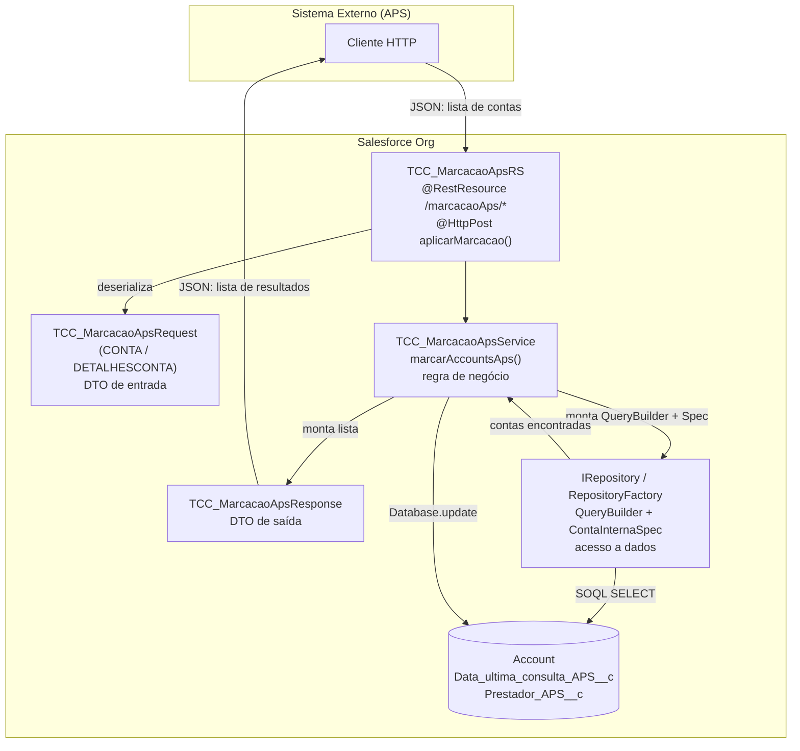
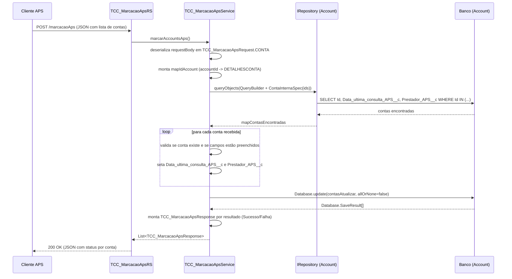

# Integração APS — Marcação de Consulta

Integração REST em Salesforce (Apex) que recebe, via `POST`, uma lista de contas (pacientes/beneficiários) com os dados da última consulta na APS (Atenção Primária à Saúde) e atualiza os campos correspondentes no objeto `Account`, retornando o resultado individual de cada registro processado.

## Endpoint

```
POST /services/apexrest/marcacaoAps
```

Implementado por `@RestResource(urlMapping='/marcacaoAps/*')` em [2_TCC_MarcacaoApsRS.cls](2_TCC_MarcacaoApsRS.cls).

## Diagrama da arquitetura

O fluxo é composto por 4 camadas: **camada REST** (recebe o HTTP request), **camada de serviço** (regra de negócio), **camada de repositório** (acesso a dados/SOQL) e o **banco de dados** (`Account`).



### Diagrama de sequência (fluxo de sucesso)



## Estrutura dos arquivos

A numeração no nome dos arquivos indica a ordem de leitura sugerida (de fora para dentro da requisição):

| Arquivo | Papel | Descrição |
|---|---|---|
| [0_TCC_MarcacaoApsRequest.cls](0_TCC_MarcacaoApsRequest.cls) | DTO de entrada | Define o formato do JSON recebido: classe `CONTA` com uma lista `req` de `DETALHESCONTA` (`accountId`, `dataUltimaConsulta`, `codigoPrestador`). |
| [1_TCC_MarcacaoApsResponse.cls](1_TCC_MarcacaoApsResponse.cls) | DTO de saída | Formato de cada item de retorno: `accountId`, `status` (`Sucesso`/`Falha`) e `mensagem`. |
| [2_TCC_MarcacaoApsRS.cls](2_TCC_MarcacaoApsRS.cls) | Camada REST | Recurso REST (`@RestResource`) que expõe o endpoint `/marcacaoAps/*` e delega o processamento ao serviço. |
| [3_TCC_MarcacaoApsService.cls](3_TCC_MarcacaoApsService.cls) | Regra de negócio | Faz o parse do request, busca as contas via repositório, valida, atualiza e monta as respostas. |
| [4_TCC_MarcacaoApsTest.cls](4_TCC_MarcacaoApsTest.cls) | Testes | Casos de teste (`@isTest`) cobrindo sucesso e os cenários de falha. |

> **Dependências externas ao pacote:** `IRepository`, `RepositoryFactory`, `Repository.QueryBuilder` e `ContaInternaSpec` implementam o padrão *Repository* (abstração de acesso a dados/SOQL) e não fazem parte destes 5 arquivos — são componentes compartilhados já existentes na org.

## Contrato da API

### Request

```json
{
  "req": [
    {
      "accountId": "0015500001IM8p8AAD",
      "dataUltimaConsulta": "2021-05-12",
      "codigoPrestador": "12345"
    }
  ]
}
```

| Campo | Tipo | Obrigatório | Descrição |
|---|---|---|---|
| `accountId` | String | Sim | Id da `Account` (paciente/beneficiário) a ser atualizada. |
| `dataUltimaConsulta` | String (`yyyy-MM-dd`) | Sim | Data da última consulta na APS. Gravada em `Account.Data_ultima_consulta_APS__c`. |
| `codigoPrestador` | String | Sim | Código do prestador que realizou o atendimento. Gravado em `Account.Prestador_APS__c`. |

### Response

```json
[
  {
    "accountId": "0015500001IM8p8AAD",
    "status": "Sucesso",
    "mensagem": "Conta atualizada com sucesso."
  }
]
```

| Campo | Descrição |
|---|---|
| `accountId` | Id da conta processada (quando disponível). |
| `status` | `Sucesso` ou `Falha`. |
| `mensagem` | Detalhe do resultado ou do erro. |

## Regras de negócio e tratamento de erros

O `TCC_MarcacaoApsService.marcarAccountsAps()` segue esta ordem de validação para cada conta recebida:

1. **Erro ao consultar contas** (ex.: falha de SOQL) → interrompe o processamento e retorna imediatamente uma única resposta de `Falha` com a mensagem da exceção.
2. **Nenhuma conta encontrada** para os ids informados → gera uma resposta de `Falha` ("Conta não encontrada.") para cada item da requisição.
3. Para cada conta informada, já com o mapa de contas existentes carregado:
   - **Conta não encontrada** entre as existentes → `Falha`: "Conta não encontrada.".
   - **Campos obrigatórios em branco** (`codigoPrestador` ou `dataUltimaConsulta`) → `Falha` com mensagem indicando qual campo está faltando.
   - **Erro de conversão** (ex.: `dataUltimaConsulta` em formato inválido, como `2021-32-12`) → interrompe o processamento e retorna a exceção como `Falha`.
   - **Dados válidos** → conta é adicionada à lista `contasAtualizar` para ser persistida.
4. **Persistência**: `Database.update(contasAtualizar, false)` — usa `allOrNone = false`, ou seja, um erro em uma conta **não** impede a atualização das demais. Cada `Database.SaveResult` gera uma resposta (`Sucesso` ou `Falha`) individual.

## Cenários cobertos pelos testes ([4_TCC_MarcacaoApsTest.cls](4_TCC_MarcacaoApsTest.cls))

| Teste | Cenário |
|---|---|
| `AtualizarMarcacaoAccountsApsSucesso` | Atualização bem-sucedida de conta existente com dados válidos. |
| `AtualizarMarcacaoAccountsApsfalhaIdContaIncorreto` | `accountId` com formato inválido (não é um Id do Salesforce). |
| `AtualizarMarcacaoAccountsApsfalhaIdContaNaoEncontrada` | `accountId` válido, mas inexistente na org. |
| `AtualizarMarcacaoAccountsApsfalhaIdContaNaoPreenchido` | `codigoPrestador` em branco. |
| `AtualizarMarcacaoAccountsApsfalhaIdContaDataIncorreta` | `dataUltimaConsulta` com formato de data inválido. |
| `AtualizarMarcacaoAccountsApsfalhaContas` | Requisição com duas contas: uma com erro de data e outra inexistente (processamento parcial). |

## Exemplo de chamada (cURL)

```bash
curl -X POST https://SEU_DOMINIO.my.salesforce.com/services/apexrest/marcacaoAps \
  -H "Authorization: Bearer SEU_ACCESS_TOKEN" \
  -H "Content-Type: application/json" \
  -d '{
        "req": [
          { "accountId": "0015500001IM8p8AAD", "dataUltimaConsulta": "2021-05-12", "codigoPrestador": "12345" }
        ]
      }'
```
